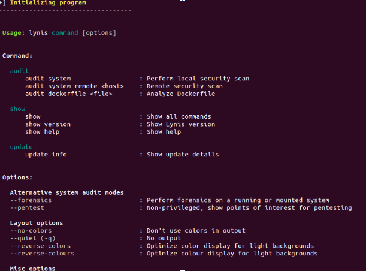
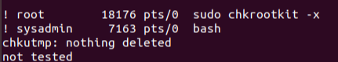

# Linux Systems Administration


## Getting started
If you would like to follow along with me
You will want to start and log into your Virtual Linux Environment. For this example I will be using Linux UBUNTU 18.04
Once Logged into you VM with your Sysadmin User, Open your Terminal and I will be able to start the demonstration

## Ensuring file access is secure

-  For this demonstration I will:
-  Altering the permission for the `/etc/shadow` and `/etc/gshadow` and set the permission for `root` read and write access, using `octal` notation.
-  Altering the permission for the `/etc/group` and `/etc/passwd` and set the permission for `root` read and write access and everyone else read access only, using `octal` notation.
-  Use the `ls` command with the `-l` option to view and verify the file permissions.

Start by inspecting the file permissions on each of the files listed, and determine if they are already set correctly or if you need to change the permissions.

  - Navigate to /etc

  - Run: `ls -l <file1>`

1. Set permissions `600` on `/etc/shadow` (`rw` for `root` only).

   - Running `ls -l /etc/shadow` indicates that the permissions are set to `640`.

2. Set permissions `600` on `/etc/gshadow` (`rw` for `root` only).

   - Running `ls -l /etc/gshadow` indicates that the permissions are set to `640`.

   - Run: `sudo chmod 600 /etc/gshadow`

3. Set permissions `644` on `/etc/group` (`rw` for `root` and `r` for all others).

   - Running `ls -l /etc/group` indicates that the permissions are already set to `644`.

   - If we needed to alter the permissions it would be run as: `sudo chmod 644 /etc/group`

4. Set permissions `644` on` /etc/passwd` (`rw` for `root` and `r` for all others).

   - Running `ls -l /etc/passwd` indicates that the permissions are already set to `644`.

  - If we needed to alter the permissions it would be run as: `sudo chmod 644 /etc/passwd`


## Create User Accounts and groups

- For this demonstration I will be:
- Adding a user by the name of `Rick` to my system, Establishing a group named `Intern`.
- Assigning `Rick` to the `Intern` group.
- Aswell as assigning a group directory for the `Intern` group

1. To create the `Rick` user.

   - Run `sudo useradd Rick` If you are following along you may configure the user how you like upon set up
   - I chose to use the command `useradd` instead of `adduser` as it does not establish and directories associated with the user

2. To create the `Intern` user group.

   - Run `sudo addgroup Intern` 
   
   - If we needed to alter the permissions it would be run as: `sudo chmod 644 /etc/passwd`

3. To add `Rick` to group.

   - Run `sudo usermod` -aG Intern `Rick`

4. To create the `Intern` group directory.

   - Run `sudo mkdir` /home/Intern

5. To change ownership of the shared directory.

   - Run `sudo chown :Intern /home/Intern`


## Create Service Users

- For this demonstration I will:
- Create a `tripwire` user that will be dedicated to running `Tripwire`
- Verify that this user is a service user.
- Verify that this user does not have a home folder.
- Verify that this user is locked without a password.
- Verify that this user does not have a login shell.
- Add a line to the sudoers file to allow this user to run only `tripwire` using sudo privileges.
- Change the permission of the `tripwire` program to only allow the owner to execute.

We will create a `tripwire` user that will be dedicated to running Tripwire:

   - Run `sudo adduser --system --no-create-home tripwire`
   - Run `id tripwire` and verify that the `UID` is less than 1000.

   - Run `ls /home` to verify there is no `tripwire` home folder.

   Remember, we can observe password entries in the `/etc/shadow` file.

   - Run `sudo tail /etc/shadow`

   The `*` in the password field for the Tripwire user means the user is locked without a password.

   - Run `sudo tail /etc/passwd`

   Note that `usr/sbin/nologin` is at the end of the Tripwire line.

3. We will add a line to the `sudoers` file in order to allow this user to run only `tripwire` using `sudo` privileges.

   - Run `sudo visudo`

   - Add `tripwire ALL= NOPASSWD: /usr/sbin/tripwire` to the user section of the file and save it.

   - The section should be as follows:
      ```bash
      # User privilege specification
      root ALL=(ALL:ALL) ALL
      tripwire ALL= NOPASSWD: /usr/sbin/tripwire
      ```

4. We will change the permission of the `tripwire` program to only allow the `owner` to execute it.

   - Run `which tripwire` to locate the `tripwire` package.

   - Run `sudo chmod 700 /usr/sbin/tripwire`

   - Run `ls -l /usr/sbin/tripwire` to verify.

## `Lynis` Auditing
- For this demonstration I will:
- Install the `Lynis` package to my system.
- Check the `Lynis` documentation for instructions on how to run a system audit.
- Run a `Lynis` system audit with `sudo`.
- Provide a sample from the `Lynis` output.
1. To Install `Lynis` 

   - Run `sudo apt install lynis`

2. To view the documentation and instructions. 

   - Run `man lynis`
3. To Run a `Lynis` system audit

   - Run `sudo lynis audit system`

4.  - Your output should be similar to:

  

##Checking for Rootkits
- For this demonstration I will:
- Install the `chkrootkit` package to my system
- Run `chkrootkit` (with sudo) in expert mode to verify that the system does not have a rootkit installed.
- Provide a sample from `chkrootkit` output with. 
1. To Install `chkrootkit` 

   - Run `sudo apt install lynis`

2. To view the documentation and instructions. 

   - Run `man chkrootkit`
3. To Run a `chkrootkit` system audit

   - Run `sudo chkrootkit -x`

4.  - Your output should be similar to:

  


